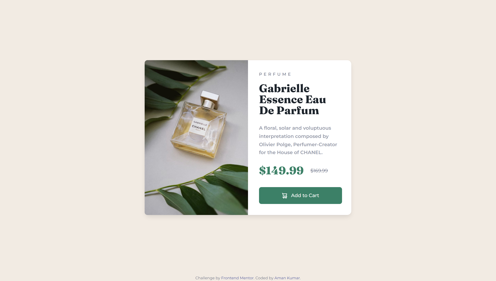
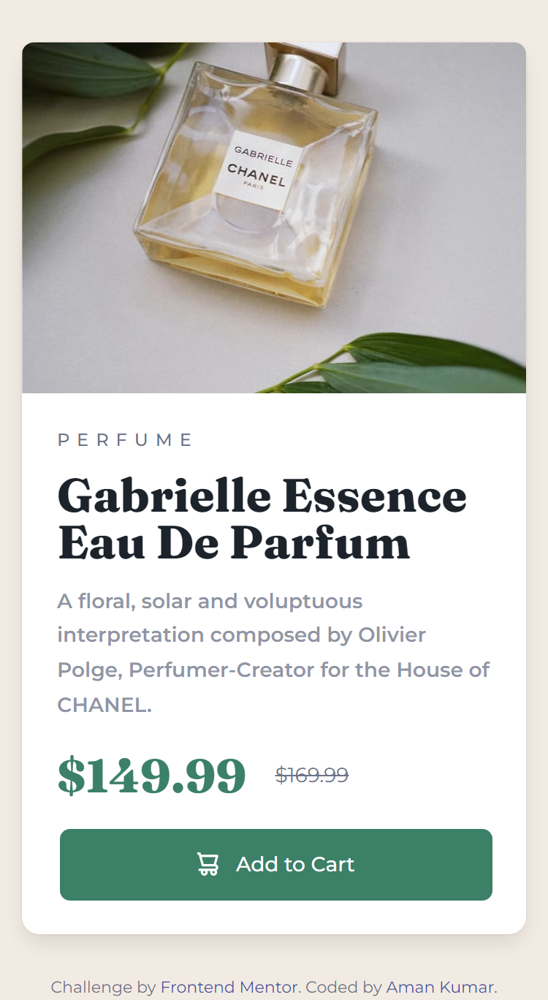

# Frontend Mentor - Product preview card component solution

This is a solution to the [Product preview card component challenge on Frontend Mentor](https://www.frontendmentor.io/challenges/product-preview-card-component-GO7UmttRfa). Frontend Mentor challenges help you improve your coding skills by building realistic projects. 

## Table of contents

- [Overview](#overview)
  - [The challenge](#the-challenge)
  - [Screenshot](#screenshot)
  - [Links](#links)
- [My process](#my-process)
  - [Built with](#built-with)
  - [What I learned](#what-i-learned)
  - [Continued development](#continued-development)
  - [Useful resources](#useful-resources)
- [Author](#author)
- [Acknowledgments](#acknowledgments)

## Overview

This challenge is given to me by my mentor, and he specifically told me to use bulma css. This challenge is about designing a responsive product card for 2 general widths, desktop and mobile.

### The challenge

Users should be able to:

- View the optimal layout depending on their device's screen size
- See hover and focus states for interactive elements

### Screenshot

### Links

- Live Site URL: [https://theamonx.github.io/product-card/](https://theamonx.github.io/product-card/)

## My process

### Built with

- HTML5
- CSS
- Bulma CSS with SASS

### What I learned

 Althought I learned various things while designing it but the main thing I learned is that Bulma CSS sucks, No offend but their official documentaion is very consize and not clear enough, no coummunity support either. I tried my level best to design it as precise as I can.

### Continued development

I although hate bulma but I got to learn about SASS and I am going to try my next frontend project with tailwind CSS.

## Author

- Website - [Amon](https://www.your-site.com)
- Frontend Mentor - [@theamonx](https://www.frontendmentor.io/profile/theamonx)

## Acknowledgments

I would like to thank my mentors from [internpluss](https://www.internpluss.com)
I would like to thank Google Search Engine, Stackoverflow and Whatsapp's meta AI... although meta did not help much but it was still better than Bulma official documentation.
